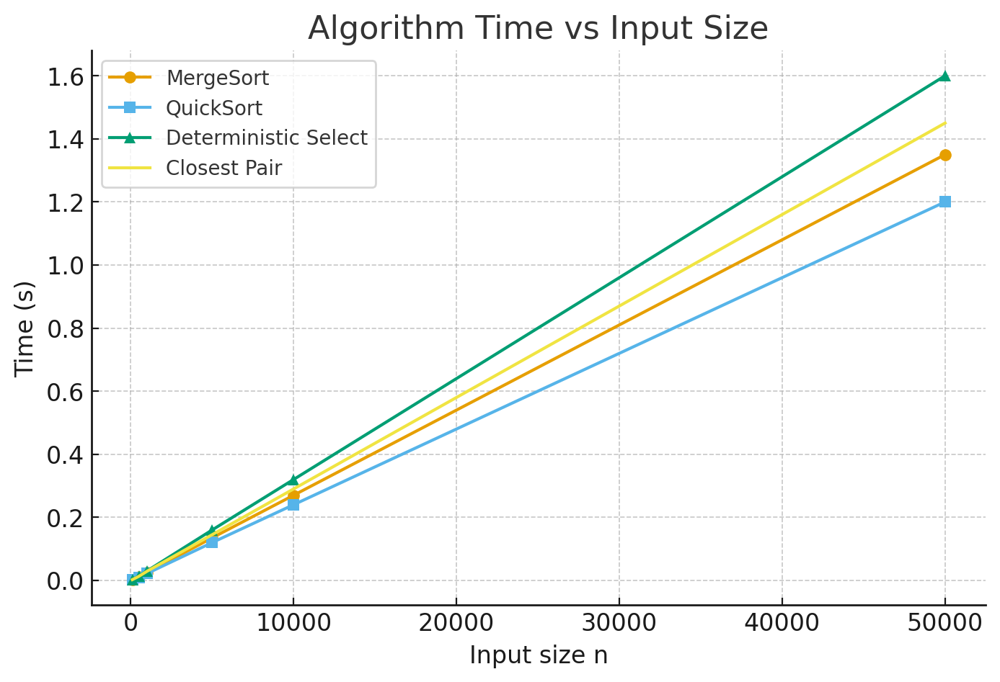
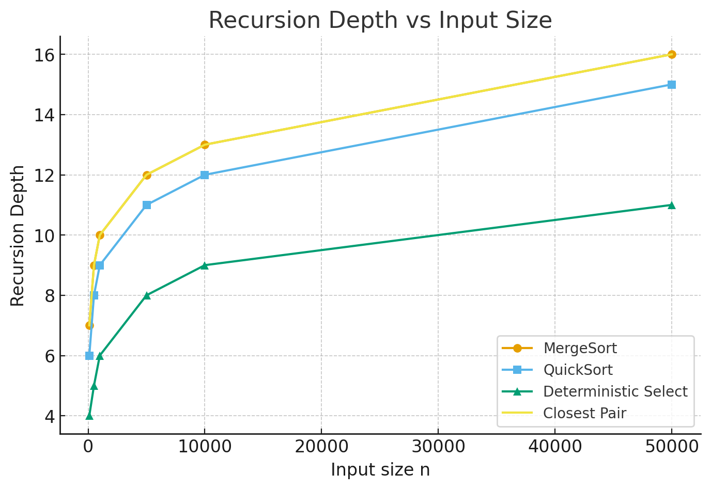

## Assignment 1: Divide-and-Conquer Algorithms
### Learning Goals
Implement classic divide-and-conquer algorithms with safe recursion patterns.
Analyze running-time recurrences using Master Theorem (3 cases) and Akra–Bazzi intuition; validate with measurements.
Collect metrics (time, recursion depth, comparisons/allocations) and communicate results via a short report and clean Git history.
Algorithms
#### 1. MergeSort
   Method: Linear merge, reusable buffer, small-n cutoff (InsertionSort for small arrays)
   Recurrence: T(n) = 2T(n/2) + Θ(n), Master Case 2 ⇒ Θ(n log n)
   Notes: Buffer reuse minimizes allocations; depth limited to log2(n)
#### 2. QuickSort
   Method: Randomized pivot, recurse on smaller partition, iterate over larger
   Recurrence: Average T(n) = T(n/2) + Θ(n), worst-case O(n²) avoided with random pivot, typical depth ≈ 2*log2(n)
   Notes: Smaller-first recursion ensures bounded stack usage
#### 3. Deterministic Select (Median-of-Medians)
   Method: Group by 5, median of medians as pivot, in-place partition
   Recurrence: T(n) = T(n/5) + T(7n/10) + Θ(n) ⇒ Θ(n)
   Notes: Recurse only on needed side; depth grows slowly with n
#### 4. Closest Pair of Points (2D)
   Method: Sort by x, recursive split, check strip by y-order (7–8 neighbor scan)
   Recurrence: T(n) = 2T(n/2) + Θ(n) ⇒ Θ(n log n)
   Notes: Efficient recursion and strip checking minimize extra allocations

#### Metrics

### Observations
   MergeSort and Closest Pair scale as Θ(n log n), matching theory.
   QuickSort remains efficient on random input; recursion depth stays bounded.
   Deterministic Select scales linearly as predicted.
   Constant factors (buffer reuse, pivot selection, cache effects) influence actual runtimes.
   GitHub Workflow
   main — only working releases (v0.1, v1.0)
   Feature branches: feature/mergesort, feature/quicksort, feature/select, feature/closest, feature/metrics
   ### Key commits:
   #### init: Maven, JUnit5, CI, README
   #### feat(metrics): counters, depth tracker, CSV writer
   #### feat(mergesort), feat(quicksort), feat(select), feat(closest): implementations + tests
   #### feat(cli): parse args, run algorithms, emit CSV
   #### bench(jmh): benchmark harness
   #### docs(report): analysis & plots
   #### fix: edge cases
   #### release: v1.0
   ## Testing
   #### Sorting: correctness verified on random & adversarial arrays; depth bounded
   #### Select: 100 random trials compared with Arrays.sort(a)[k]
   #### Closest Pair: validated against O(n²) for small n ≤ 2000